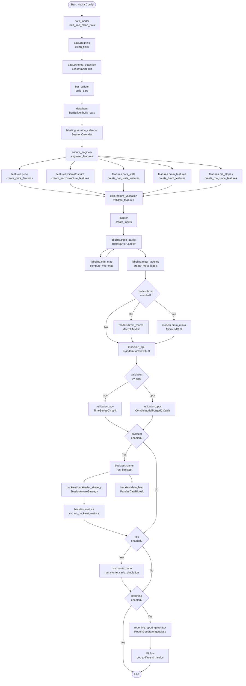
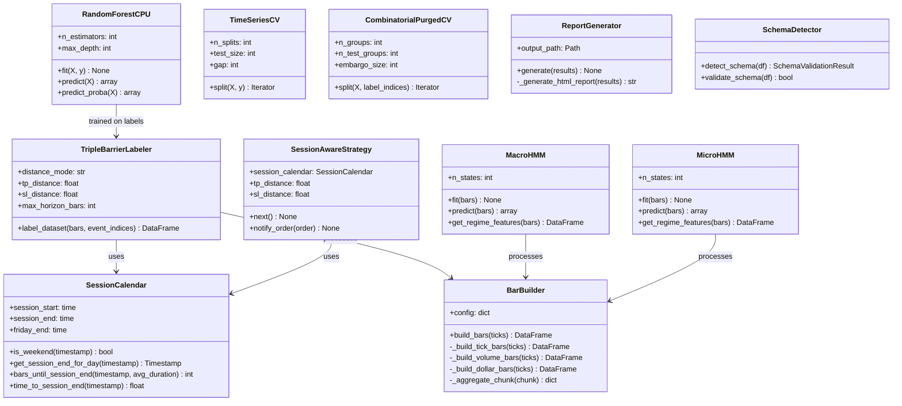
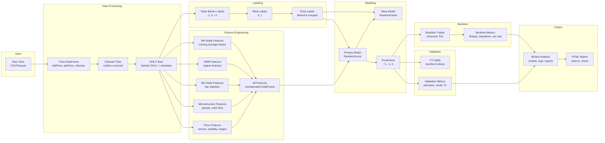

# Architecture Diagrams

This document provides visual representations of the FinancialMLPipeline architecture using Mermaid diagrams. These diagrams help understand module relationships, data flow, and test coverage.

---

## Table of Contents

1. [Module Overview](#1-module-overview)
2. [Pipeline Flow Diagram](#2-pipeline-flow-diagram)
3. [Class Diagram](#3-class-diagram)
4. [Data Flow Diagram](#4-data-flow-diagram)
5. [Test Coverage Map](#5-test-coverage-map)
6. [Module Dependencies](#6-module-dependencies)

---

## 1. Module Overview

High-level view of all modules in the project:

```mermaid
graph TB
    subgraph "Data Layer"
        A1[data.bars<br/>BarBuilder]
        A2[data.cleaning<br/>clean_ticks]
        A3[data.schema_detection<br/>SchemaDetector]
        A4[data.fractional_diff<br/>frac_diff]
    end
    
    subgraph "Features Layer"
        B1[features.price<br/>create_price_features]
        B2[features.microstructure<br/>create_microstructure_features]
        B3[features.bars_stats<br/>create_bar_stats_features]
        B4[features.hmm_features<br/>create_hmm_features]
        B5[features.ma_slopes<br/>create_ma_slope_features]
    end
    
    subgraph "Labeling Layer"
        C1[labeling.triple_barrier<br/>TripleBarrierLabeler]
        C2[labeling.session_calendar<br/>SessionCalendar]
        C3[labeling.mfe_mae<br/>compute_mfe_mae]
        C4[labeling.meta_labeling<br/>create_meta_labels]
    end
    
    subgraph "Models Layer"
        D1[models.rf_cpu<br/>RandomForestCPU]
        D2[models.hmm_macro<br/>MacroHMM]
        D3[models.hmm_micro<br/>MicroHMM]
    end
    
    subgraph "Validation Layer"
        E1[validation.tscv<br/>TimeSeriesCV]
        E2[validation.cpcv<br/>CombinatorialPurgedCV]
    end
    
    subgraph "Backtest Layer"
        F1[backtest.runner<br/>run_backtest]
        F2[backtest.backtrader_strategy<br/>SessionAwareStrategy]
        F3[backtest.data_feed<br/>PandasDataBidAsk]
        F4[backtest.metrics<br/>BacktestMetrics]
    end
    
    subgraph "Risk Layer"
        G1[risk.monte_carlo<br/>run_monte_carlo_simulation]
    end
    
    subgraph "Reporting Layer"
        H1[reporting.report_generator<br/>ReportGenerator]
    end
    
    subgraph "Pipeline Orchestration"
        I1[pipeline.main_pipeline<br/>run_pipeline]
        I2[pipeline.data_loader<br/>load_and_clean_data]
        I3[pipeline.bar_builder<br/>build_bars]
        I4[pipeline.feature_engineer<br/>engineer_features]
        I5[pipeline.labeler<br/>create_labels]
    end
    
    subgraph "Utils Layer"
        J1[utils.logging_config<br/>setup_logging]
        J2[utils.feature_validation<br/>validate_features]
        J3[utils.config_helpers<br/>load_config]
        J4[utils.data_leakage_audit<br/>audit_feature_functions]
    end
```

---

## 2. Pipeline Flow Diagram

Complete data flow through the pipeline:

---

## 3. Class Diagram

Main classes and their relationships:

---

## 4. Data Flow Diagram

Detailed data transformations:

---

## 5. Test Coverage Map

Visual representation of test coverage:

```mermaid
graph TB
    subgraph "✅ Tested Modules"
        T1[data.bars<br/>✓ Unit Tests]
        T2[data.cleaning<br/>✓ Unit Tests]
        T3[data.schema_detection<br/>✓ Unit Tests]
        T4[features.price<br/>✓ Unit Tests]
        T5[features.microstructure<br/>✓ Unit Tests]
        T6[features.bars_stats<br/>✓ Unit Tests]
        T7[features.hmm_features<br/>✓ Unit Tests]
        T8[features.ma_slopes<br/>✓ Unit Tests]
        T9[labeling.triple_barrier<br/>✓ Unit Tests]
        T10[labeling.session_calendar<br/>✓ Unit Tests]
        T11[labeling.mfe_mae<br/>✓ Unit Tests]
        T12[labeling.meta_labeling<br/>✓ Unit Tests]
        T13[models.rf_cpu<br/>✓ Unit Tests]
        T14[models.hmm_macro<br/>✓ Unit Tests]
        T15[models.hmm_micro<br/>✓ Unit Tests]
        T16[validation.cpcv<br/>✓ Unit Tests]
        T17[validation.tscv<br/>✓ Unit Tests]
        T18[backtest.data_feed<br/>✓ Unit Tests]
        T19[backtest.metrics<br/>✓ Unit Tests]
        T20[risk.monte_carlo<br/>✓ Unit Tests]
        T21[reporting.report_generator<br/>✓ Unit Tests]
        T22[utils.feature_validation<br/>✓ Unit Tests]
        T23[utils.helpers<br/>✓ Unit Tests]
        T24[pipeline.data_loader<br/>✓ Unit Tests]
        T25[pipeline.bar_builder<br/>✓ Unit Tests]
        T26[pipeline.feature_engineer<br/>✓ Unit Tests]
        T27[pipeline.labeler<br/>✓ Unit Tests]
        T28[Integration: Data Pipeline<br/>✓ Integration Tests]
        T29[E2E: Sanity & Small EURUSD<br/>✓ E2E Tests]
        T30[Performance: Bars & Features<br/>✓ Performance Tests]
    end
    
    subgraph "❌ Missing Tests"
        M1[data.fractional_diff<br/>❌ No Tests]
        M2[backtest.runner<br/>❌ No Tests]
        M3[backtest.backtrader_strategy<br/>❌ No Tests]
        M4[utils.data_leakage_audit<br/>❌ No Tests]
        M5[utils.config_helpers<br/>❌ No Tests]
    end
    
    style T1 fill:#90EE90
    style T2 fill:#90EE90
    style T3 fill:#90EE90
    style T4 fill:#90EE90
    style T5 fill:#90EE90
    style T6 fill:#90EE90
    style T7 fill:#90EE90
    style T8 fill:#90EE90
    style T9 fill:#90EE90
    style T10 fill:#90EE90
    style T11 fill:#90EE90
    style T12 fill:#90EE90
    style T13 fill:#90EE90
    style T14 fill:#90EE90
    style T15 fill:#90EE90
    style T16 fill:#90EE90
    style T17 fill:#90EE90
    style T18 fill:#90EE90
    style T19 fill:#90EE90
    style T20 fill:#90EE90
    style T21 fill:#90EE90
    style T22 fill:#90EE90
    style T23 fill:#90EE90
    style T24 fill:#90EE90
    style T25 fill:#90EE90
    style T26 fill:#90EE90
    style T27 fill:#90EE90
    style T28 fill:#90EE90
    style T29 fill:#90EE90
    style T30 fill:#90EE90
    
    style M1 fill:#FFB6C1
    style M2 fill:#FFB6C1
    style M3 fill:#FFB6C1
    style M4 fill:#FFB6C1
    style M5 fill:#FFB6C1
```

---

## 6. Module Dependencies

Dependency graph showing module relationships:

```mermaid
graph TD
    subgraph "Core Pipeline"
        Main[pipeline.main_pipeline]
        DataLoader[pipeline.data_loader]
        BarBuilderMod[pipeline.bar_builder]
        FeatureEng[pipeline.feature_engineer]
        LabelerMod[pipeline.labeler]
    end
    
    subgraph "Data Modules"
        Bars[data.bars]
        Cleaning[data.cleaning]
        Schema[data.schema_detection]
        FracDiff[data.fractional_diff]
    end
    
    subgraph "Feature Modules"
        PriceFeat[features.price]
        MicroFeat[features.microstructure]
        BarStats[features.bars_stats]
        HMMFeat[features.hmm_features]
        MASlopes[features.ma_slopes]
    end
    
    subgraph "Labeling Modules"
        TripleBarrier[labeling.triple_barrier]
        SessionCal[labeling.session_calendar]
        MFEMAE[labeling.mfe_mae]
        MetaLabel[labeling.meta_labeling]
    end
    
    subgraph "Model Modules"
        RF[models.rf_cpu]
        HMMMacro[models.hmm_macro]
        HMMMicro[models.hmm_micro]
    end
    
    subgraph "Validation Modules"
        TSCV[validation.tscv]
        CPCV[validation.cpcv]
    end
    
    subgraph "Backtest Modules"
        BacktestRunner[backtest.runner]
        BacktestStrat[backtest.backtrader_strategy]
        BacktestFeed[backtest.data_feed]
        BacktestMetrics[backtest.metrics]
    end
    
    subgraph "Other Modules"
        Risk[risk.monte_carlo]
        Report[reporting.report_generator]
        Utils[utils.*]
    end
    
    Main --> DataLoader
    Main --> BarBuilderMod
    Main --> FeatureEng
    Main --> LabelerMod
    Main --> RF
    Main --> HMMMacro
    Main --> HMMMicro
    Main --> TSCV
    Main --> CPCV
    Main --> BacktestRunner
    Main --> Risk
    Main --> Report
    Main --> Utils
    
    DataLoader --> Cleaning
    DataLoader --> Schema
    
    BarBuilderMod --> Bars
    BarBuilderMod --> SessionCal
    
    FeatureEng --> PriceFeat
    FeatureEng --> MicroFeat
    FeatureEng --> BarStats
    FeatureEng --> HMMFeat
    FeatureEng --> MASlopes
    
    LabelerMod --> TripleBarrier
    LabelerMod --> MetaLabel
    
    TripleBarrier --> SessionCal
    TripleBarrier --> MFEMAE
    
    HMMFeat --> HMMMacro
    HMMFeat --> HMMMicro
    
    BacktestRunner --> BacktestStrat
    BacktestRunner --> BacktestFeed
    BacktestRunner --> BacktestMetrics
    BacktestRunner --> SessionCal
    
    Utils --> Bars
    Utils --> PriceFeat
    Utils --> MicroFeat
```

---

## Summary

### Test Coverage Status

**Covered (30 modules/components):**
- ✅ `data.bars` - Unit tests
- ✅ `data.cleaning` - Unit tests
- ✅ `data.schema_detection` - Unit tests
- ✅ `features.price` - Unit tests
- ✅ `features.microstructure` - Unit tests
- ✅ `features.bars_stats` - Unit tests
- ✅ `features.hmm_features` - Unit tests
- ✅ `features.ma_slopes` - Unit tests
- ✅ `labeling.triple_barrier` - Unit tests
- ✅ `labeling.session_calendar` - Unit tests
- ✅ `labeling.mfe_mae` - Unit tests
- ✅ `labeling.meta_labeling` - Unit tests
- ✅ `models.rf_cpu` - Unit tests
- ✅ `models.hmm_macro` - Unit tests
- ✅ `models.hmm_micro` - Unit tests
- ✅ `validation.cpcv` - Unit tests
- ✅ `validation.tscv` - Unit tests
- ✅ `backtest.data_feed` - Unit tests
- ✅ `backtest.metrics` - Unit tests
- ✅ `risk.monte_carlo` - Unit tests
- ✅ `reporting.report_generator` - Unit tests
- ✅ `utils.feature_validation` - Unit tests
- ✅ `utils.helpers` - Unit tests
- ✅ `pipeline.data_loader` - Unit tests
- ✅ `pipeline.bar_builder` - Unit tests
- ✅ `pipeline.feature_engineer` - Unit tests
- ✅ `pipeline.labeler` - Unit tests
- ✅ Data pipeline integration - Integration tests
- ✅ E2E pipeline - E2E tests
- ✅ Performance tests - Bars & features

**Missing Tests (5 modules):**
- ❌ `data.fractional_diff` - Fractional differencing (optional feature)
- ❌ `backtest.runner` - Backtest orchestration (complex, requires Backtrader setup)
- ❌ `backtest.backtrader_strategy` - Strategy implementation (complex, requires Backtrader)
- ❌ `utils.data_leakage_audit` - Static analysis tool (optional)
- ❌ `utils.config_helpers` - Configuration helpers (simple wrappers)

### Recommendations

**Remaining modules to test (low priority):**

1. **Optional/Complex Modules:**
   - `data.fractional_diff` - Optional feature (fractional differencing)
   - `backtest.runner` - Complex orchestration (requires full Backtrader setup)
   - `backtest.backtrader_strategy` - Strategy class (requires Backtrader engine)

2. **Utility Modules:**
   - `utils.data_leakage_audit` - Static analysis tool (can be tested separately)
   - `utils.config_helpers` - Simple configuration wrappers

**Note:** The core pipeline is now fully tested. The remaining modules are either optional features or complex integration components that would benefit from integration/E2E tests rather than unit tests.

---

## References

- [TESTING.md](TESTING.md) - Testing strategy and guidelines
- [ARCHITECTURE.md](ARCHITECTURE.md) - Architecture overview
- [CODING_STANDARDS.md](CODING_STANDARDS.md) - Code standards

