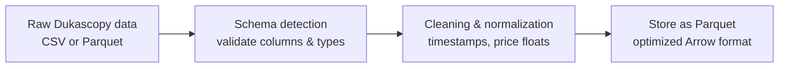
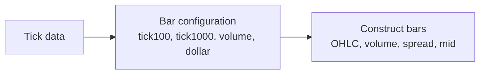

# Data Pipeline Architecture

This document describes how raw tick data (mainly from Dukascopy via dukascopy-node) is ingested, validated, processed, converted into bars, transformed into features, and finally labeled using the Lopez de Prado methodology.

It defines conventions, schemas, preprocessing rules, and guarantees the prevention of data leakage.

---

## 1. Raw Data Format

### 1.1 Expected Dukascopy Schema

Dukascopy tick data typically follows the structure:

- timestamp: UNIX epoch in milliseconds
- askPrice: float
- bidPrice: float
- askVolume: float (may be included depending on instrument/provider)
- bidVolume: float (may be included depending on instrument/provider)

Example (CSV):

```csv
timestamp,askPrice,bidPrice,askVolume,bidVolume
1585526400104,1.12001,1.11998,100000,100000
```

Notes:

- timestamp must be converted to UTC datetime
- askPrice > bidPrice always
- spread = askPrice - bidPrice
- volumes may be optional depending on the instrument

### 1.2 Schema Variations

The pipeline must handle:

- CSV vs Parquet
- Presence or absence of volume columns
- Correct data types (float64, int64, proper timestamps)

A detection module (`schema_detection.py`) should:

- Verify required columns
- Detect missing or extra columns
- Validate data types
- Mark whether volume is meaningful/usable for volume/dollar bars

---

## 2. Data Ingestion Flow



### 2.1 Cleaning

Cleaning includes (non-exhaustive):

- Standardizing timestamps to UTC
- Ensuring chronological order
- Dropping corrupted ticks (NaN, infinite values)
- Ensuring askPrice > bidPrice when possible
- Optionally computing midPrice and spread

### 2.2 Storage

After cleaning, data is stored in Parquet format as the canonical on-disk representation.

---

## 3. Bar Construction

Supported bar types:

- **Tick bars**: every N ticks (100, 200, 1000…)
- **Volume bars**: every N units of volume (if volume is meaningful)
- **Dollar bars**: every N notional units
- **Heikin-Ashi bars**
- **Event-based bars** (volatility triggers, directional triggers)

Constraints:

- No forward-looking bias
- Only information available at the moment
- Configurable via Hydra

### 3.1 Bar Builder Flow



Modules:

- `bars_pandas.py`
- `bars_polars.py`
- `bars_gpu.py`

---

## 4. Fractional Differencing

Fractional differencing increases stationarity while preserving memory.

Configuration example:

```yaml
features:
  fractional_diff:
    enabled: true
    d: 0.4
    columns: ["midPrice", "close"]
```

Module: `fracdiff.py`

---

## 5. Feature Engineering

### 5.1 Price-Based Features

Examples:

- Log returns
- Rolling volatility
- Bar ranges
- Multi-timeframe aggregates

### 5.2 Microstructure Features

Examples:

- Bid/ask imbalance
- Spread level and changes
- Tick direction
- Signed volume
- Order flow imbalance

### 5.3 Bar-Derived Features

Examples:

- Bar returns
- Bar ranges
- Bar volume
- Tick count per bar

---

## 6. Labeling (Lopez de Prado)

This implementation assumes **long-only directional labeling**.  
Short-side labels can be generated later via feature symmetry.

### 6.1 Entry Price (Long)

A long position opens at:

```python
entry_price = askPrice(t0)
```

### 6.2 Upper Barrier (Take Profit)

A long TP is reached when:

```python
bid(t) >= entry_price + tp_distance
```

Because selling a long hits the **BID**, not the ask.

### 6.3 Lower Barrier (Stop Loss)

A long SL is reached when:

```python
bid(t) <= entry_price - sl_distance
```

Stop-loss exits also hit the **BID**.

### 6.4 Time Barrier

If neither barrier is hit before `t0 + H`:

```python
exit_price = bid(t0 + H)
```

### 6.5 Resulting Label

- `+1` = TP hit first
- `-1` = SL hit first
- `0` = Time barrier hit without TP or SL

### 6.6 Meta-Labeling

- `meta = 1` if the model's signal would have produced a profitable outcome
- `meta = 0` otherwise

### 6.7 Session-Aware Time Barrier (No Overnight Constraint)

Sessions and overnight risk are explicitly modeled in the triple barrier implementation.

**Context**: The account does not hold positions overnight on the raw spread account, to avoid:

- High rollover/commission costs
- Gap risk (especially on weekends)
- Swap fees

Therefore, **all positions must be flat before the end of each trading session**.

#### Session Calendar

We introduce:

- A **session calendar** (`session_start`, `session_end` per day)
- For Forex, even though it's 24h/24 (except weekends), the account has a **rollover hour** (typically 22:00, 23:00, or 00:00 UTC depending on broker)

Example configuration:

```yaml
session:
  session_start: "00:00"  # UTC
  session_end: "21:55"    # UTC (5 min margin before rollover)
  friday_end: "20:00"     # early close before weekend
  weekend_trading: false  # no Saturday/Sunday
```

#### Effective Time Barrier Computation

For each event starting at `t0`, we compute:

```python
time_until_session_end = session_end - t0
effective_time_barrier = min(max_holding_horizon, time_until_session_end)
```

#### Modified Triple Barrier Logic

The triple barrier logic becomes:

1. **Entry price (long)**: `askPrice` at `t0`
2. **Upper barrier (TP)**: hit when `bid(t) >= entry_price + tp_distance`
3. **Lower barrier (SL)**: hit when `bid(t) <= entry_price - sl_distance`
4. **Time barrier**: last valid timestamp before `effective_time_barrier`
   - At the time barrier, we exit at `bid` and compute the outcome

**Result**:

- If neither TP nor SL is hit before the `effective_time_barrier`, the label is `0` (neutral)
- The trade is assumed closed at the last `bid` before session end

#### No-Trade Zone (Optional)

Optionally, if `time_until_session_end < min_horizon_bars`, **no label is created** for that event (no-trade zone near session end).

Configuration example:

```yaml
labeling:
  triple_barrier:
    tp_ticks: 100
    sl_ticks: 100
    max_horizon_bars: 50
    min_horizon_bars: 10  # don't create labels if < 10 bars to session end
```

This prevents creating unrealistic labels for trades that would have insufficient time to develop.

#### Benefits

This approach ensures that:

- Labels are **consistent** with the "no overnight" constraint
- The model **never learns** trades that rely on holding beyond session boundaries
- Backtests and live behaviour remain **aligned**
- Risk of gap and swap costs is eliminated from training data

#### Data Annotation

The dataset should include:

- `session_id` (integer, unique per day)
- `time_to_session_end` (in seconds or bars)
- `is_near_session_end` (boolean flag)

These features can also be used by the model to learn session-dependent patterns.

### 6.8 Modules

- `triple_barrier.py`
- `meta_labeling.py`
- `session_calendar.py`

---

## 7. Final Data Output

The final dataset includes:

- Cleaned bar data (OHLC, volume, spread)
- Engineered features (price-based + microstructure)
- Directional label (-1, 0, 1)
- Meta-label (0 or 1, optional)
- Timestamps
- Bar configuration metadata

Used as input for:

- HMM macro/micro
- Base model
- Meta-label model
- Walk-forward evaluation
