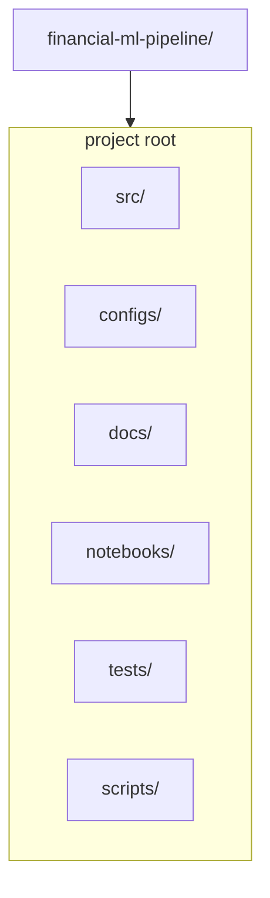

# Infrastructure & Repository Architecture

This document explains the infrastructure, directory layout, environment setup, experiment tracking system, and deployment strategy for the machine learning trading pipeline.

It is designed so both humans and AI assistants can understand the entire project structure.

---

## 1. Repository Structure (High-Level)



### Description of top-level folders

- **src/**: All Python source code, modularized by domain.
- **configs/**: Hydra YAML configuration files.
- **docs/**: Architecture, design docs, coding standards, reporting structure.
- **notebooks/**: Exploratory analysis, debugging, prototyping.
- **tests/**: Unit tests and integration tests.
- **scripts/**: CLI utilities for running training, backtesting, inference, benchmarks.

---

## 2. Source Code Layout (Detailed)

Inside the `src` directory, the following modules exist:

- **src/data/**: Ingestion from CSV/Parquet, schema detection, bar builders (pandas/polars/cuDF).
- **src/features/**: Feature engineering: price-based, microstructure, bar-statistics.
- **src/labeling/**: Triple barrier and meta-label construction.
- **src/models/**: Base models (RF CPU, RF GPU), HMMs, calibration utilities, MLflow registry.
- **src/validation/**: Time-series splits, purging, embargo, walk-forward evaluation.
- **src/backtest/**: Backtrader adapter, strategies, extraction of PnL and trade metrics.
- **src/risk/**: Monte Carlo simulations, drawdown metrics, rolling risk statistics.
- **src/interpretability/**: Feature importance, SHAP, regime analysis.
- **src/reporting/**: Jinja2 HTML/PDF reports, template environment, report builder.
- **src/deployment/**: Inference utilities and loading of MLflow-trained models.
- **src/benchmarks/**: Pandas vs Polars vs cuDF comparison, profiling tools, performance tests.
- **src/utils/**: Logging utilities, common helpers, configuration management, typing.

---

## 3. Hydra Configuration System

Hydra is used to define structured experiment configurations.

Recommended folder layout:

```
configs/
  config.yaml (entrypoint)
  data/
    dukascopy.yaml
    bars.yaml
  experiment/
    base.yaml
    walkforward.yaml
  models/
    rf_cpu.yaml
    rf_gpu.yaml
    meta.yaml
    hmm.yaml
  risk/
    basic.yaml
    monte_carlo.yaml
```

Example Hydra configuration snippet:

```yaml
experiment:
  name: "eurusd_tick_1000_rf"
  instrument: "EURUSD"
  seed: 42

data:
  source: "dukascopy"
  format: "auto"
  path: "data/raw/eurusd/"
  bars:
    types: ["tick1000"]
    main: "tick1000"

hmm:
  macro:
    enabled: true
    n_states: 3
  micro:
    enabled: true
    n_states: 3

models:
  base:
    type: "rf_cpu"
    n_estimators: 200
    max_depth: 10
  meta:
    enabled: true
    type: "rf_cpu"

risk:
  walk_forward:
    enabled: true
    n_splits: 5
  monte_carlo:
    enabled: true
    n_sims: 1000

session:
  session_start: "00:00"
  session_end: "21:55"
  friday_end: "20:00"
  weekend_trading: false

labeling:
  triple_barrier:
    tp_ticks: 100
    sl_ticks: 100
    max_horizon_bars: 50
    min_horizon_bars: 10
```

---

## 4. MLflow Tracking System

MLflow is used for experiment tracking, parameter logging, artifact storage, and optional model registry.

Each experiment logs:

### Parameters:
- bar type, model type, HMM states, features enabled, data period, etc.

### Metrics:
- Sharpe ratio
- Max drawdown
- Total PnL
- Win rate
- Segment-by-segment metrics (walk-forward)

### Artifacts:
- Equity curves
- Trade logs
- Confusion matrices
- Feature importance plots
- Regime diagrams
- HTML/PDF report
- Saved model pickles or MLflow models

The directory structure for MLflow (default local mode):

```
mlruns/
  experiment_id/
    run_id/
      params/
      metrics/
      artifacts/
        models/
        plots/
        reports/
```

The module `registry_mlflow.py` provides:

- `start_run()` wrapper
- `log_params()`, `log_metrics()`
- save model artifacts
- load models for inference

---

## 5. Inference Architecture (CLI-Based)

Inference is deliberately simple to avoid over-complication.

The design requirements are:

- must run locally
- must run quickly
- must accept raw features or bar data
- must load MLflow-trained models
- must return a simple JSON or CSV signal

### CLI Command Structure

Example usage:

```bash
python scripts/predict_cli.py \
  --model-path path/to/model.pkl \
  --config configs/config.yaml \
  --input data/live_features.json \
  --output signals.json
```

`predict_cli.py` responsibilities:

- load trained MLflow model
- load feature pipeline transformations (if used)
- load incoming data (JSON, CSV, or live feed in the future)
- run prediction
- output a JSON object containing:
  - direction
  - probability
  - regime info
  - optional position size

This design can later be wrapped by an MT5 Python bridge or a lightweight HTTP server.

---

## 6. Docker Support (Future Integration)

Two Docker images are planned:

### docker/Dockerfile.train
- Contains all dependencies for training, including MLflow
- Useful for reproducible environments

### docker/Dockerfile.inference
- Lightweight
- Only contains dependencies for loading models and running predictions

Both will include:

- Python 3.12+
- Numpy, Pandas, Polars, cuDF (optional GPU image)
- Scikit-learn / cuML
- Jinja2
- Backtrader
- Hydra
- MLflow client

---

## 7. CI/CD (Optional Extension)

Later, a CI pipeline (GitHub Actions recommended) may:

- run unit tests
- run benchmarks
- enforce formatting (ruff, black)
- check that the project builds correctly
- run a minimal walk-forward test as a regression check

---

## 8. Environment Structure

Recommended conda environment:

```yaml
name: financial-ml
dependencies:
  - python=3.12
  - pandas
  - polars
  - numpy
  - pyarrow
  - scikit-learn
  - hmmlearn or pomegranate
  - mlflow
  - hydra-core
  - jinja2
  - backtrader
  - cudf and cuml (optional, GPU only)
```

---

## 9. Logging System

Use the standard Python `logging` module.

Guidelines:

- no `print()` calls
- separate logs per module
- include timestamp, module, and experiment ID
- logs should be stored inside mlflow artifacts for each run
