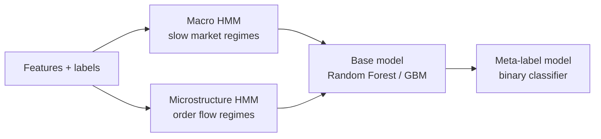
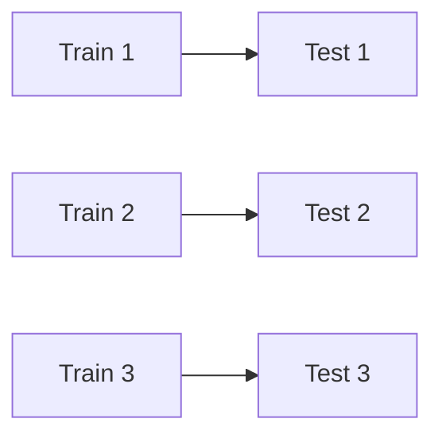
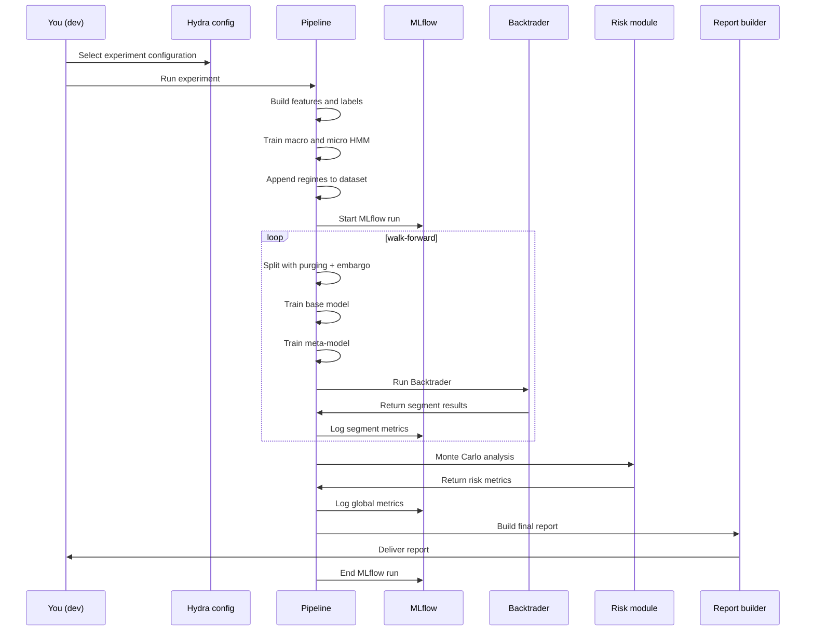

# Machine Learning Pipeline Architecture

This document describes the modelling and evaluation pipeline, including:

- Regime detection with two HMMs (macro + microstructure)
- Base model training (Random Forest / Gradient Boosting, CPU or GPU)
- Meta-labeling
- Time-series cross-validation with purging & embargo
- Walk-forward evaluation
- MLflow logging and integration with backtesting and risk analysis

---

## 1. High-Level ML Pipeline



The HMM outputs (macro_regime, micro_regime) become input features for both the base model and the meta-label model.

---

## 2. Regime Detection with HMMs

### 2.1 Macro HMM

**Goal**: Identify slow-moving, high-level market regimes such as:

- trending up
- trending down
- high volatility
- low volatility
- range-bound vs directional

**Input features** (examples):

- returns from longer bars
- rolling volatility
- smoothed trend signals
- price acceleration

**Outputs**:

- macro_regime (integer: 0, 1, 2…)
- optional probability distribution per state

**File**: `hmm_macro.py`

### 2.2 Microstructure HMM

**Goal**: Detect microstructure states driven by order flow, such as:

- buyer aggression
- seller aggression
- liquidity thinness
- spread regime

**Input features**:

- order flow imbalance
- spread and spread changes
- tick direction
- quote updates
- signed volume (if available)

**Outputs**:

- micro_regime (integer)
- optional regime probabilities

**File**: `hmm_micro.py`

---

## 3. Base Model (Random Forest / Gradient Boosting)

Two possible infrastructures:

- RF CPU (sklearn)
- RF GPU (RAPIDS cuML)
- optionally Gradient Boosting (XGBoost, LightGBM, sklearn GBM)

**Inputs**:

- engineered features
- macro_regime
- micro_regime
- contextual risk or volatility features (optional)

**Output**:

- Directional forecast: class or probability

**Files**:

- `rf_cpu.py`
- `rf_gpu_cuml.py`
- `calibration.py` (optional)

---

## 4. Meta-Labeling

A second model trained to decide whether to take the trade.

**Inputs**:

- base model probability
- macro/micro regimes
- volatility features
- spread/cost features
- triple barrier outcome

**Output**:

- `1` = take trade
- `0` = skip trade

Meta-labeling is one of the strongest improvements for risk-adjusted performance.

**File**: `meta_labeling.py`

---

## 5. Time-Series Cross-Validation (Purging & Embargo)

Classical CV is invalid in finance due to leakage.

This project uses:

- Time-based CV
- Purging (remove overlapping labels)
- Embargo (gap between train and test windows)

**Files**:

- `time_split.py`
- `purging_embargo.py`

---

## 6. Walk-Forward Evaluation

Simulates real-world conditions by sequential training and testing windows:

Example:

- Train window 1 → Test window 1
- Train window 2 → Test window 2
- Train window 3 → Test window 3



**File**: `walk_forward.py`

Metrics are logged per segment:

- Sharpe
- PnL
- Max drawdown
- Accuracy (optional)
- Win rate
- Volatility of returns

---

## 7. Integration with Backtesting (Backtrader)

For each walk-forward segment:

1. The base model generates forecasts
2. The meta-model filters trades
3. Backtrader executes the strategy
4. Metrics and trades are logged

**Files**:

- `backtest/bt_adapter.py`
- `backtest/bt_strategies.py`
- `backtest/bt_to_metrics.py`

The output is an equity curve per segment and overall.

---

### 7.1 Session Management in Backtrader

To align with the **no overnight constraint** from the labeling phase, the Backtrader strategy must enforce the same rules.

#### Flat Before Session End

At each bar, the strategy checks the current time:

```python
def next(self):
    current_dt = self.data.datetime.datetime(0)
    
    # Force close all positions before session end
    if self.is_near_session_end(current_dt):
        if self.position:
            self.close()  # close all open positions
            self.log(f"Session end approaching - closing position at {current_dt}")
        return  # no new entries
    
    # Normal trading logic...
```

#### No-Trade Zone

The strategy should also respect the `min_horizon_bars` constraint:

```python
def is_near_session_end(self, current_dt):
    """
    Returns True if we're too close to session end.
    Uses the same calendar as the labeling phase.
    """
    time_to_session_end = self.get_time_to_session_end(current_dt)
    min_horizon = self.params.min_horizon_bars * self.bar_duration
    
    return time_to_session_end < min_horizon
```

#### Session Calendar Integration

The strategy loads the same session calendar used during labeling:

```python
class MLStrategy(bt.Strategy):
    params = (
        ('session_calendar', None),  # loaded from config
        ('min_horizon_bars', 10),
        ('safety_margin_minutes', 5),
    )
    
    def __init__(self):
        self.session_calendar = self.params.session_calendar
        # ...
```

#### Weekend Handling

The strategy automatically skips weekends:

```python
def is_trading_allowed(self, current_dt):
    """Check if current time is within a valid trading session."""
    weekday = current_dt.weekday()
    
    # Skip Saturday (5) and Sunday (6)
    if weekday >= 5:
        return False
    
    # Check if within session hours
    current_time = current_dt.time()
    session_start = self.session_calendar['session_start']
    session_end = self.session_calendar['session_end']
    
    # Friday early close
    if weekday == 4:  # Friday
        session_end = self.session_calendar['friday_end']
    
    return session_start <= current_time <= session_end
```

#### Benefits

This implementation ensures:

- ✅ **Perfect alignment** between labeling and backtesting logic
- ✅ **No overnight positions** in backtest results
- ✅ **Realistic simulation** of prop firm constraints
- ✅ **Consistent risk metrics** (no gap risk in equity curve)

---

## 8. MLflow Tracking

Every experiment run logs:

### Parameters:

- instrument
- bar types
- model configuration
- HMM parameters
- fractional differencing status

### Metrics:

- Sharpe
- Max DD
- PnL
- Accuracy / win rate
- Metrics per walk-forward segment

### Artifacts:

- equity curves
- trade logs
- confusion matrices
- feature importance
- SHAP plots (optional)
- macro/micro regime visualizations
- final report (HTML/PDF)

**File**: `registry_mlflow.py`

---

## 9. End-to-End ML Sequence (for documentation)


