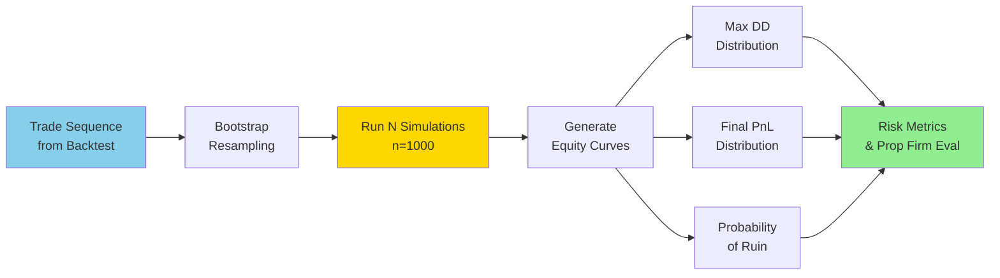

# Risk Module Architecture

This document describes the risk analysis components:

- Walk-forward analysis
- Monte Carlo on trade sequences
- Drawdown and risk metrics

---

# 1. Walk-Forward Analysis

Walk-forward measures **stability** across time by comparing:

- performance per segment
- Sharpe ratio distribution
- Drawdowns per segment
- Win rate drift
- Regime performance patterns

The result is exported into MLflow with plots and tables.

---

# 2. Monte Carlo on Trades

The Monte Carlo engine operates on the sequence of closed trades produced by the session-aware backtester, so that all simulations respect the same intraday/no-overnight constraint as the original strategy.

This is critical for:

- prop firm evaluation
- robustness assessment
- probability of ruin estimation

### 2.1 Inputs

- Trade PnL list
- Trade durations or timestamps (optional)
- Block bootstrap option (optional)

### 2.2 Outputs

- Distribution of equity curves
- Distribution of max drawdown
- Distribution of final PnL
- Probability of:
  - hitting a max loss limit
  - failing a prop challenge threshold

### 2.4 Monte Carlo Workflow

Each simulation produces a synthetic equity curve by randomly resampling the historical trade sequence. This generates distributions of possible outcomes.

### 2.3 Session-Aware Risk Context (No Overnight)

All risk analysis in this project is session-aware and consistent with the no-overnight constraint defined in the data and backtesting pipeline:

All trades used in the risk module come from a backtest that enforces:

session start / end times,

no new entries too close to session end (min_horizon_bars),

forced flat before the session closes (no overnight positions),

no weekend trading.

As a consequence:

Monte Carlo simulations are performed on trade sequences that already respect the session calendar.

There is no overnight gap risk in the simulated equity curves, because positions are never held across sessions.

Swap / rollover / weekend gap risk is intentionally excluded from the risk distribution, by design of the trading rules.

This is especially important for prop firm evaluation:

The probability of hitting daily / overall loss limits is computed under the assumption that all trades are intraday or intra-session.

Any risk metric (max drawdown, time under water, probability of ruin) is therefore computed in a regime where overnight exposure is structurally prevented, not merely “unlikely”.

---

# 3. Drawdown Metrics

Includes:

- Max drawdown
- Average drawdown
- Ulcer index
- Time-under-water
- Rolling max drawdown

---

# 4. Risk Reporting

Risk results appear in the experiment report:

- tables
- violin plots
- cumulative distribution of DD
- probability of ruin indicator
- stop-out scenarios

