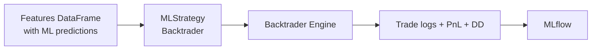
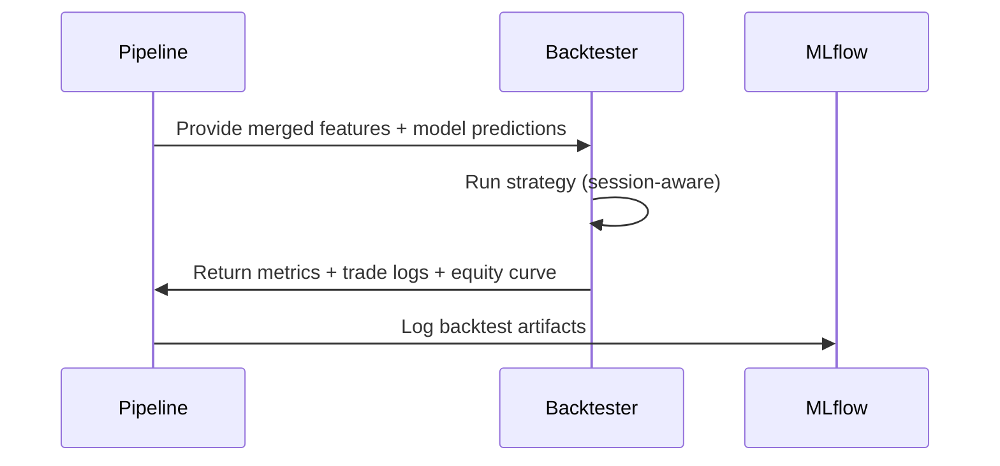

# Backtesting Architecture

This document describes how backtesting is implemented in the pipeline using **Backtrader**, with strict alignment to:

- raw-spread FX execution (ask entry, bid exit),
- no-overnight positions (session calendar),
- triple-barrier labeling rules,
- walk-forward evaluation,
- meta-label filtering,
- realistic constraints for prop firm accounts.

The strategy must behave **exactly** like the labeling logic — otherwise results would be inconsistent.

---

## 1. Goals and Design Principles

The backtesting subsystem must:

### ✔ Use the same execution assumptions as training

- Entry price = ask
- Exit price = bid
- Spread included (no mid-price execution)

### ✔ Enforce no-overnight rules

- Close **all positions** before session end
- No new trades near session close (configurable)

### ✔ Use ML signals safely

- Predictions from base model (directional)
- Predictions from meta-model (take or skip)

### ✔ Be deterministic and reproducible

- No randomness in order execution
- No slippage unless explicitly configured

### ✔ Produce extensive logs

- per-trade logs
- equity curve
- daily results
- drawdown metrics

All backtest artifacts are logged into MLflow.

---

## 2. Backtester Architecture



The features include:

- timestamp
- OHLC (bid/ask or mid depending on bar config)
- model_signal (direction)
- model_probability
- meta_label_decision (0/1)
- macro_regime, micro_regime
- trade costs (if any)

---

## 3. Session Calendar (Critical)

The strategy must use the same session logic as labeling:

```yaml
session:
  timezone: "UTC"
  session_start: "00:00"
  session_end: "21:55"
  friday_end: "20:00"
  weekend_trading: false
  min_horizon_bars: 10
```

### 3.1 No Overnight Rule

Every day:

- Open positions must be closed before `session_end`.
- No new entries allowed when close to `session_end`.

### 3.2 Friday Early Close

Friday uses a different cutoff (`friday_end`), to avoid weekend gaps.

### 3.3 Weekend Handling

Saturday and Sunday are forced no-trade periods.

---

## 4. Backtrader Strategy Implementation

The strategy lives in:

```
src/backtest/bt_strategies.py
```

Recommended class:

```python
class MLStrategy(bt.Strategy):
    pass
```

The strategy must:

- load the session calendar
- read ML model outputs
- filter entries using meta-label
- close trades at session end
- enforce raw-spread execution price rules

---

## 5. Input Data Format

Backtrader receives a merged DataFrame:

| timestamp | open_bid | high_bid | low_bid | close_bid | open_ask | ... | model_signal | probability | meta_decision |
|-----------|----------|----------|---------|-----------|----------|-----|--------------|-------------|---------------|

Data is converted to a Backtrader data feed via:

```python
feed = PandasDataBidAsk(dataname=df)
```

A custom data feed is required to expose bid/ask separately.

---

## 6. Execution Logic

### 6.1 Entries (Long-Only for now)

When `model_signal = +1` AND `meta_decision = 1`:

- enter long at **ask price**
- store entry timestamp
- store predicted probability (logging)

### 6.2 Exits

Positions can close:

**A. When opposite signal appears**

(not recommended initially)

**B. Session close**

→ mandatory exit at **bid price**

**C. Stop loss / take profit**

(taken from labeling config)

**D. Time-based exit**

(rarely used in backtest, but allowed)

---

## 7. SL/TP Execution

Same as in labeling:

### Stop Loss (for long)

Triggered when:

```python
bid <= entry_price - sl_distance
```

### Take Profit (for long)

Triggered when:

```python
bid >= entry_price + tp_distance
```

This makes the strategy match the triple-barrier setup perfectly.

---

## 8. Meta-Model Integration

Meta-model output determines whether a trade is taken:

- `meta_decision = 1` → allow trade
- `meta_decision = 0` → skip trade

If the meta-model is disabled:

- default behavior: take all base model signals

The base model still produces a directional probability for reporting.

---

## 9. Position Sizing (Optional)

For v1:

```yaml
sizing:
  mode: fixed
  size: 1.0    # in lots or "units" depending on config
```

Future extensions:

- risk-based sizing (vol-adjusted)
- Kelly fraction
- regime-dependent sizing

---

## 10. Backtester Outputs

Everything must be saved to MLflow.

### 10.1 Equity Curve

A simple `(timestamp, equity)` curve.

### 10.2 Trade Log

For each trade:

- entry timestamp
- exit timestamp
- entry price (ask)
- exit price (bid)
- duration
- PnL
- return in %
- reason for exit (TP, SL, session close, signal reversal)
- macro_regime / micro_regime snapshot
- model_probability

### 10.3 Daily Stats

Useful for prop firm constraints:

- daily PnL
- daily max DD
- daily volatility

### 10.4 Drawdown Curve

Stored as:

```
plots/drawdown.png
plots/equity.png
plots/trade_histogram.png
```

---

## 11. Backtest Pipeline Integration

Backtest integrates inside the experiment flow:



Backtests are run per walk-forward segment, then aggregated.

---

## 12. Walk-Forward Backtesting

Each walk-forward segment behaves like a "mini live trading session":

- model trained on segment N
- predictions applied on segment N+1
- backtested independently
- metrics aggregated across segments

Backtesting must never use:

- future data from other segments
- future HMM regimes
- future spread statistics

---

## 13. Realism Constraints

These rules enforce realistic execution:

- ✔ Execution at correct side (ask entry, bid exit)
- ✔ No mid-price assumptions
- ✔ No overnight holding
- ✔ Fixed slippage = 0 unless configured
- ✔ Spread always included
- ✔ No latency simulation (optional later)

If you want, you can add:

- slippage model
- partial fills
- liquidity constraints
- commission per lot

But these are optional for v1.

---

## 14. Config Parameters Reference

Example:

```yaml
backtest:
  sizing:
    mode: fixed
    size: 1.0

  slippage:
    enabled: false
    ticks: 0

  session:
    use_calendar: true

  logs:
    save_trades: true
    save_equity: true
```

---

## 15. AI Guidelines

These guardrails ensure AI assistants write consistent backtest code:

- Never use mid-price for execution unless explicitly asked.
- Always reference `session_calendar` for entry/exit constraints.
- Never create a Backtrader strategy not aligned with triple barrier logic.
- Never use random slippage or commissions unless in config.
- Always use the custom `PandasDataBidAsk` feed (bid+ask).
- Keep the strategy deterministic and reproducible.
- Do not invent new trade management rules.
- Do not enable short positions unless requested explicitly.

---

## 16. Future Extensions

Possible improvements:

- Multi-asset backtesting
- Slippage proportional to volatility or spread
- GPU-accelerated backtesting (custom)
- Reinforcement learning live decision simulation
- Multi-timeframe backtesting

These are out of scope for v1.

