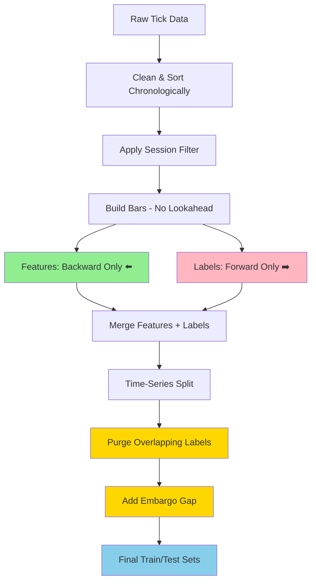

# Data Handling and Preprocessing

This document describes how raw tick data is ingested, validated, normalized, transformed into bars, and prepared for feature engineering and labeling.

It defines the exact rules the system must follow to avoid data leakage, maintain consistency across assets, and stay aligned with the trading constraints of the project (raw spread, tick-based execution, no overnight positions).

---

## 1. Raw Tick Data

### 1.1 Expected Schema

Raw data comes from `dukascopy-node` and typically has the following fields:

- `timestamp` → UNIX epoch in milliseconds
- `askPrice` → float
- `bidPrice` → float
- `askVolume` → float (may be synthetic or absent depending on instrument)
- `bidVolume` → float

Example:

```json
{
  "timestamp": 1585526400104,
  "askPrice": 1.11369,
  "bidPrice": 1.11361,
  "askVolume": 0.75,
  "bidVolume": 0.75
}
```

**Notes**:

- `askPrice > bidPrice` must always hold.
- Spread = `askPrice − bidPrice`.
- FX volumes can be synthetic ⇒ optional for volume bars.
- Timestamps must be strictly increasing after cleaning.

### 1.2 Schema Detection

A dedicated module (`schema_detection.py`) must:

- Detect whether data is CSV or Parquet.
- Validate presence of required columns.
- Detect optional columns (volumes).
- Validate numeric dtypes (float64, int64).
- Convert timestamps into timezone-aware UTC datetimes.
- Mark whether volume is usable (`volume_usable: true/false`).

**If schema is invalid**:

The system must raise a clear, descriptive exception (no silent fallback).

---

## 2. Cleaning & Normalization

The cleaning step ensures that all downstream modules operate on sanitized, consistent data.

### 2.1 Cleaning Rules

- Convert `timestamp` (epoch ms → UTC datetime).
- Sort by `timestamp` (ascending).
- Drop corrupted rows:
  - NaN or infinite prices
  - `askPrice ≤ bidPrice`
  - negative or invalid volumes
- Drop duplicate timestamps.
- Enforce strictly increasing timestamps (no zero-time deltas).

### 2.2 Derived Fields

Optional but recommended:

- `midPrice = (askPrice + bidPrice) / 2`
- `spread = askPrice - bidPrice`

### 2.3 Output Storage

Cleaned data is saved as Parquet (Arrow) in:

```
data/clean/<symbol>/YYYY.parquet
```

Parquet is chosen because:

- fast IO,
- efficient compression,
- consistent schema,
- Arrow compatibility with pandas, polars, and cuDF.

---

## 3. Session Handling (Critical Financial Logic)

The project uses **no overnight positions** and **session-aware labeling**.  
This logic applies both in labeling and backtesting.

### 3.1 Session Calendar

Read from config:

```yaml
session:
  timezone: "UTC"
  session_start: "00:00"
  session_end: "21:55"
  friday_end: "20:00"
  weekend_trading: false
```

### 3.2 Session-Aware Tick Filtration

Before building bars:

- Remove ticks outside allowed session windows.
- Remove Saturday/Sunday ticks entirely.
- On Friday, apply early close logic (`friday_end`).

This ensures:

- Labels are consistent with backtesting conditions.
- The dataset does not include impossible trade windows.

### 3.3 Session Timeline Visualization

```mermaid
gantt
    title Trading Session Timeline (No Overnight Constraint)
    dateFormat HH:mm
    axisFormat %H:%M
    
    section Mon-Thu
    Active Trading    :active, 00:00, 21h55m
    No-Trade Zone     :crit, 21:55, 5m
    Forced Flat       :done, 22:00, 2h
    
    section Friday
    Active Trading    :active, 00:00, 20h00m
    Early Close       :crit, 20:00, 4h
    
    section Weekend
    No Trading        :done, 00:00, 48h
```



This diagram shows:
- **Green**: Normal trading hours
- **Red**: No-trade zone (positions must be closed)
- **Grey**: Forced flat / no trading period

---

## 4. Bar Construction

Bars are built from cleaned ticks, using multiple bar types concurrently.

**Supported types**:

- **Tick bars** (100, 200, 1000 ticks…)
- **Volume bars** (if volume is meaningful)
- **Dollar bars** (optional future extension)
- **Heikin-Ashi** (transformation applied on OHLC)
- **Event-based bars** (directional triggers, volatility triggers — optional)

**All bars must avoid lookahead bias.**

### 4.1 Tick Bars

Tick bars are the default and primary bar type.

Example:

```yaml
bars:
  main_type: "tick1000"
  tick:
    sizes: [100, 200, 1000]
```

**Rules**:

- Bar is complete after N ticks.
- OHLC built from bid/ask midpoints or from bid/ask separately.
- Volume = sum of raw volumes (if available).
- Spread statistics may be aggregated inside the bar.

### 4.2 Volume Bars

Used only if volume is meaningful (`volume_usable = true`).  
If volume is synthetic or constant → volume bars disabled.

### 4.3 Dollar Bars (future)

Not required for now, but structure allows it.

### 4.4 Heikin-Ashi Bars

Computed after classical OHLC bars:

- Does not replace base bars.
- Used in features only (never for labeling or execution).
- Must avoid leakage by only referencing past bars.

### 4.5 Event Bars (optional)

Triggered when:

- direction threshold reached,
- volatility threshold reached.

Useful but not required in v1.

---

## 5. Multi-Bar Synchronization

Since the pipeline may build several bar types simultaneously:

- Each bar type is aligned on its own timeline.
- Feature generation must respect each bar's internal chronology.
- When joining features, always use **as-of joins** (no forward fill beyond current timestamp).
- No bar type may use data from another bar type derived from the future.

---

## 6. Feature Preparation

### 6.1 Price Features

Examples:

- log returns
- bar ranges
- rolling volatility
- bar-to-bar spread variation
- multi-horizon returns

### 6.2 Microstructure Features

Examples:

- order flow imbalance
- signed tick direction
- quote update frequency
- spread level / spread changes
- average bid/ask movement inside bar

These features are extracted at the tick level or per-bar-level depending on configuration.

### 6.3 Bar Statistics

Examples:

- tick count per bar
- bar duration (in seconds)
- bar volume
- spread per bar

### 6.4 Fractional Differencing (optional)

If enabled:

- Applied to selected columns.
- Must not leak future information.
- Must handle missing values without forward-looking imputation.

---

## 7. Labeling Data Requirements

Triple barrier uses:

- entry price at t₀ = `askPrice(t₀)`
- TP/SL checks on `bid(t)`
- time barrier managed by session calendar

Labels require:

- High-resolution tick data per bar (for exact barrier hits)
- Session-aware trimming to avoid overnight exposure
- Configurable TP/SL distances in ticks

**Labeling output includes**:

- `t1`: exit timestamp
- `label`: {-1, 0, 1}
- `meta_label`: optional
- `event_start`, `event_end`
- `bar_index_start`, `bar_index_end`

---

## 8. Data Leakage Prevention Rules

**Critical constraints**:

- ❌ **No forward filling into the future**  
  Only backward-looking operations allowed.

- ❌ **No using future bars or future ticks**  
  Bar boundaries must be defined using information available up to that moment only.

- ❌ **No mixing timestamps from after the event**  
  Features must rely only on data up to the bar start.

- ❌ **No leakage between train/test via overlapping labels**  
  Purging and embargo enforce independence.

### 8.1 Data Flow with Leakage Prevention



**Key principles**:
- Features use **past data only** (backward-looking)
- Labels use **future data** (forward-looking, but isolated)
- Purging removes overlapping labels between train/test
- Embargo adds time gap to prevent indirect leakage

---

## 9. Final Data Output Format

The processed dataset for modeling must include:

- **Timestamp** (UTC)
- **OHLC** bid/ask or mid
- **Volume / tick count**
- **Spread stats**
- **Price features**
- **Microstructure features**
- **Regime features** (HMM macro/micro)
- **Label** (triple barrier)
- **Meta label**
- **Session metadata**:
  - `session_id`
  - `time_to_session_end`
  - `is_near_session_end`

Saved as a Parquet file:

```
data/processed/<symbol>/<bar_type>/
```

This becomes the input for:

- model training,
- walk-forward validation,
- backtesting,
- risk analysis.

