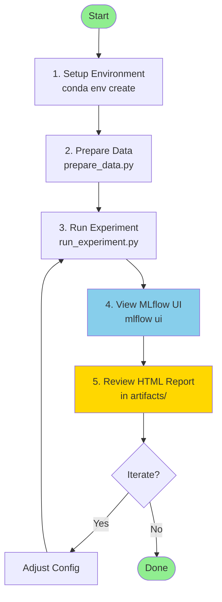

# How to Run the Trading ML Pipeline

This document explains how to:

- set up the environment
- download and clean data
- run an experiment (training + walk-forward + backtest + risk)
- inspect results with MLflow
- reproduce a past run

It is written for both **you** and **AI assistants**.

---

## 1. Prerequisites

### 1.1 Environment

Create and activate the conda environment (or equivalent):

```bash
conda env create -f environment.yml
conda activate trading-ml
```

The environment should include at least:

- Python 3.12
- numpy, pandas, polars, pyarrow
- scikit-learn
- hmmlearn or pomegranate
- backtrader
- hydra-core
- mlflow
- jinja2
- (optional) cudf / cuml for GPU

Check that the package versions match the project's `environment.yml`.

### 1.2 Project Structure

At minimum, the repo should look like:

```
trading-ml-pipeline/
  configs/
  src/
  data/
  docs/
  scripts/
```

Make sure `src/` is on the Python path, e.g. by installing the project in editable mode:

```bash
pip install -e .
```

or by using `PYTHONPATH=./src` when running scripts.

---

## 1.3 Quick Start Workflow



---

## 2. Data Preparation

### 2.1 Download Raw Data

Raw data is assumed to come from dukascopy-node or a similar tool.

You should end up with tick data files (CSV or Parquet), for example:

```
data/raw/EURUSD/
  2019/
  2020/
```

Each file must follow the expected Dukascopy schema:

- `timestamp` (epoch ms)
- `askPrice`
- `bidPrice`
- `askVolume` (optional)
- `bidVolume` (optional)

### 2.2 Clean & Normalize Data

Data cleaning and Parquet conversion is handled via a dedicated script, e.g.:

```bash
python scripts/prepare_data.py \
  experiment=base \
  assets=EURUSD \
  data=dukascopy
```

What this script does:

- Detects file format (CSV or Parquet).
- Validates the schema (columns and dtypes).
- Cleans the data (sorted timestamps, no NaNs, bid < ask, etc.).
- Applies the session calendar (no ticks outside trading sessions).
- Saves cleaned data as Parquet under:

```
data/clean/EURUSD/
```

You normally run this **once per symbol / date range**.

---

## 3. Running an Experiment

All experiments are launched via Hydra using a main entry script, for example:

```bash
python scripts/run_experiment.py
```

This script will:

- Load configs from `configs/`.
- Build bars & features.
- Train HMMs (macro + micro).
- Train the base model + meta-model.
- Perform walk-forward validation.
- Run a Backtrader backtest (session-aware, no overnight).
- Run risk analysis (Monte Carlo on trade sequence).
- Log everything to MLflow.
- Generate an HTML report.

### 3.1 Selecting Configs via Hydra

You can override defaults from the command line. For example:

```bash
python scripts/run_experiment.py \
  experiment.name=eurusd_tick1000_rf \
  assets=EURUSD \
  data.bars.main_type=tick1000 \
  models=rf_cpu \
  models/hmm=hmm \
  labeling=triple_barrier \
  session=default_fx
```

Or use a more concise override:

```bash
python scripts/run_experiment.py \
  experiment=base \
  assets=EURUSD \
  models=rf_cpu
```

Hydra automatically merges:

- `configs/config.yaml`
- the selected defaults
- your command line overrides

### 3.2 Typical First Run

Example baseline run:

```bash
python scripts/run_experiment.py \
  experiment=base \
  assets=EURUSD \
  data=dukascopy \
  data/bars=bars \
  models=rf_cpu \
  models/hmm=hmm \
  labeling=triple_barrier \
  session=default_fx \
  risk=basic \
  risk/monte_carlo=monte_carlo \
  backtest=base_bt \
  reporting=report \
  mlflow=local
```

This will:

- use EURUSD tick data,
- build tick bars (e.g., tick1000),
- apply triple-barrier labeling with session-aware horizon,
- train RF + meta model + HMMs,
- run walk-forward + backtest,
- run Monte Carlo risk analysis,
- log everything in MLflow under `mlruns/`,
- produce an HTML report in MLflow artifacts.

---

## 4. Monitoring Experiments with MLflow

Start the MLflow UI in a separate terminal:

```bash
# From project root directory
mlflow ui --backend-store-uri file:./mlruns
```

**Important**: 
- Run this command from the **project root** (where `mlruns/` directory is located)
- The `--backend-store-uri` must match the `tracking_uri` in `configs/mlflow/local.yaml` (default: `file:./mlruns`)
- If `mlruns/` doesn't exist yet, it will be created automatically on first experiment run

Then open in your browser:

```
http://127.0.0.1:5000
```

You can then:

- inspect parameter sets,
- compare metrics across runs,
- download artifacts (reports, plots, logs).

**Key artifacts**:

- `config/config.yaml` → full Hydra config used
- `reports/<name>.html` → full experiment report
- `backtest_trade_log.csv` → detailed trade log
- `backtest_equity_curve.csv` → equity curve over time
- `plots/` → equity curves, drawdown charts, etc. (if generated)

**For detailed MLflow usage, see [MLFLOW.md](MLFLOW.md)**

---

## 5. Reproducing a Past Run

To reproduce a past run:

1. **In MLflow UI**:
   - find the run of interest,
   - note the `git_commit` tag,
   - download the `config/config.yaml` artifact,
   - note dataset / date range.

2. **In git**:

```bash
git checkout <git_commit_hash>
```

3. **Option A**: Use the downloaded config directly (custom script).

4. **Option B**: Recreate the same overrides from the stored config.

Example override (if config is simple):

```bash
python scripts/run_experiment.py \
  experiment.name=eurusd_tick1000_rf \
  assets=EURUSD \
  data.date_range.start=2019-01-01 \
  data.date_range.end=2020-12-31 \
  models=rf_cpu \
  session=default_fx \
  labeling=triple_barrier
```

If you want a perfect reproduction, ensure that:

- the environment matches (`environment.yml` or `pip freeze` logged),
- the data files are identical (same clean Parquet, same path).

---

## 6. Running Only Parts of the Pipeline

In some cases you might want to run:

- only data preparation,
- only backtesting on a pre-trained model,
- only risk analysis on an existing trade log.

You can implement and call dedicated scripts, for example:

### 6.1 Data Only

```bash
python scripts/prepare_data.py \
  experiment=base \
  assets=EURUSD \
  data=dukascopy
```

### 6.2 Backtest Only

Assuming a model has already been trained and saved:

```bash
python scripts/run_backtest.py \
  assets=EURUSD \
  data/bars=bars \
  backtest=base_bt \
  models=rf_cpu \
  session=default_fx
```

### 6.3 Risk Analysis Only

Assuming a trade log exists:

```bash
python scripts/run_risk.py \
  risk/monte_carlo=monte_carlo \
  experiment.name=eurusd_tick1000_rf_risk_only
```

---

## 7. Logging & Debugging

Logs should be written using the Python `logging` module and stored per run.

Typical pattern:

```python
import logging

logger = logging.getLogger(__name__)

logger.info("Starting experiment")
```

Each experiment can attach its main log file as an MLflow artifact:

```
logs/experiment.log
```

**For debugging**:

- start with a smaller dataset (shorter date range),
- reduce `n_splits` in walk-forward,
- reduce Monte Carlo `n_sims`.

---

## 8. Using GPU (Optional)

If you have a GPU setup with RAPIDS/cuML:

1. Install appropriate RAPIDS version (see RAPIDS docs).

2. Use GPU config:

```bash
python scripts/run_experiment.py \
  models=rf_gpu \
  runtime.use_gpu=true
```

**Ensure**:

- data fits in GPU memory,
- you benchmark CPU vs GPU with small experiments first.

---

## 9. Typical Workflow Summary

1. Download raw ticks (e.g. from Dukascopy).
2. Prepare data: run `prepare_data.py` once per symbol / date range.
3. Run a baseline experiment with `run_experiment.py`.
4. Inspect results in MLflow (metrics + report).
5. Adjust configs (bars, labeling, model parameters, risk) via Hydra.
6. Re-run experiments and compare in MLflow.
7. When satisfied, export the model and/or backtest results for further use.

---

## 10. AI Usage Guidelines

When asking an AI assistant to modify or create scripts:

- Always refer to `HOW_TO_RUN.md` to keep entrypoints consistent (`run_experiment.py`, `prepare_data.py`, etc.).
- Do not create new random entry scripts (`train.py`, `main.py`) without aligning with this document.
- Respect existing CLI options and Hydra config names.
- If new CLI options are added, they must be:
  - documented here,
  - consistent with the configuration reference.

**This file is the source of truth for how to run the project.**

