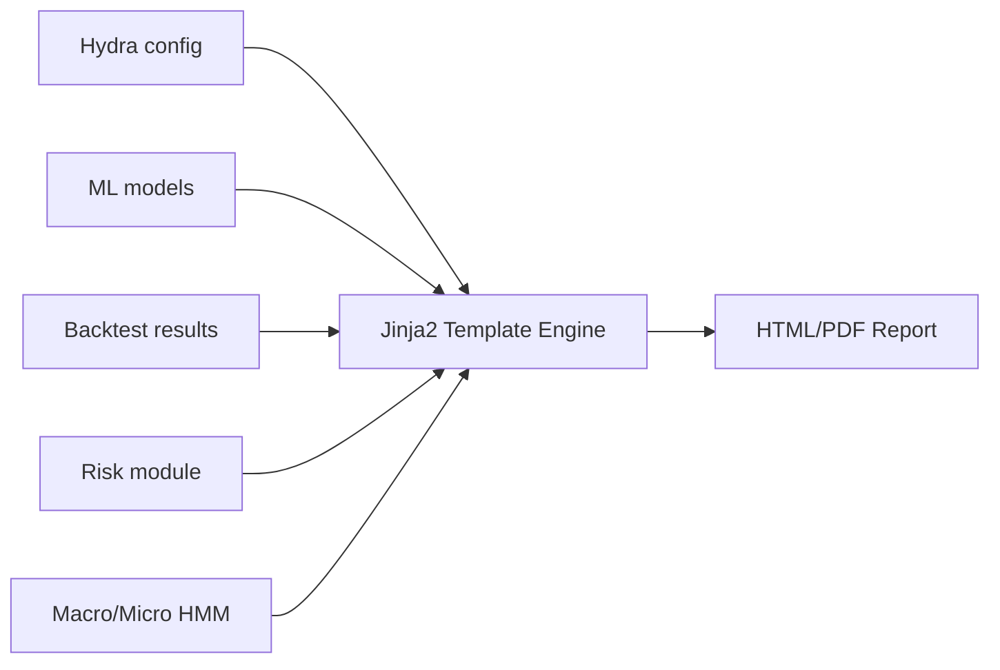

# Reporting System

This document describes how experiment reports are generated, structured, and interpreted.

Reports summarize the full ML pipeline results:

- dataset summary
- model performance
- walk-forward behavior
- backtest results
- risk analysis (Monte Carlo, drawdowns)
- feature importance
- HMM regimes
- final conclusions

Reports are produced as **HTML** via Jinja2, with optional PDF export.

---

## 1. Overview

A report is generated for every experiment run.

The reporting system collects:

- Hydra config (full dump)
- ML metrics (logged in MLflow)
- Backtest results
- Trade logs
- Walk-forward segment metrics
- Risk simulation outputs
- Feature importance / SHAP plots
- Regime diagrams (HMM macro/micro)

The report is stored as an MLflow artifact.

---

## 2. Reporting Workflow



Report generation happens after:

- HMM training
- Model training
- Walk-forward evaluation
- Backtest execution
- Risk analysis

---

## 3. File Structure

Directory:

```
src/reporting/
    templates/
        base.html
        header.html
        section_data.html
        section_model.html
        section_walkforward.html
        section_backtest.html
        section_risk.html
        section_regimes.html
        section_features.html
        section_conclusion.html
    build_report.py
    export_pdf.py         # optional PDF export
```

- `base.html`: master layout
- each section in a dedicated template → easy for AI assistants to update independently

---

## 4. Generated Outputs

### 4.1 HTML Report (primary output)

Saved under MLflow:

```
artifacts/reports/<experiment_name>.html
```

### 4.2 PDF Report (optional)

Produced only if enabled in config:

```yaml
reporting:
  pdf:
    enabled: true
```

Converted via:

- wkhtmltopdf, OR
- WeasyPrint, OR
- a thin wrapper in `src/reporting/export_pdf.py`

---

## 5. Data Sources Used in the Report

Each section pulls from different modules:

| Section | Data Source |
|---------|-------------|
| Data overview | cleaned bars + config |
| Feature summary | feature matrix metadata |
| HMM regimes | hmm_macro, hmm_micro outputs |
| Model metrics | MLflow local metrics |
| Walk-forward | validation segments |
| Backtest results | Backtrader logs |
| Risk | Monte Carlo sim outputs |
| Feature importance | model-specific tools (RF importances, SHAP optional) |

Every figure is saved in MLflow and referenced by the HTML.

---

## 6. Report Structure (Section by Section)

Below is the canonical structure used by `base.html`.

### 6.1 Title + Metadata

Includes:

- experiment name
- timestamp
- asset
- bar type
- dataset date range
- git commit hash
- comment / description from config

Example:

```
Experiment: eurusd_tick1000_rf
Asset: EURUSD
Bars: tick1000
Commit: 293fbd2
Date range: 2019–2020
```

### 6.2 Configuration Summary

A readable version of key config items:

- asset config (tick_size, lot size…)
- bar construction parameters
- labeling parameters (triple barrier)
- session rules (no overnight)
- model parameters (RF/HMM/meta)
- walk-forward settings
- risk model settings

This section helps reproduce experiments.

### 6.3 Data Overview

Includes:

- number of ticks
- number of bars
- session trimming (ticks removed)
- spread statistics (mean/median/std)
- bar duration distribution
- volume summary (if volume usable)

Optional small plots:

- histogram of spreads
- bar duration histogram
- tick count per bar distribution

### 6.4 Feature Summary

Lists all features:

- price features
- microstructure features
- bar statistics
- fractional differencing (if enabled)

Includes:

- feature count
- missing values check
- feature correlations heatmap (optional)

### 6.5 HMM Regime Analysis

For both macro and micro HMM:

- state definitions (#0, #1, #2…)
- state probabilities over time
- regime duration statistics
- regime transition matrix

Example plots:

- state vs time
- price colored by regimes

Used to validate that regimes are meaningful and stable.

### 6.6 Model Performance

**Base model metrics**:

- accuracy (optional)
- precision/recall (optional)
- ROC/AUC (optional)
- win rate before meta-model
- distribution of predicted probabilities

**Meta-label model**:

- meta accuracy
- meta precision
- probability threshold behavior
- confusion matrix
- probability calibration curves (if enabled)

### 6.7 Walk-Forward Evaluation

For each segment:

- train date range
- test date range
- Sharpe
- PnL
- max drawdown
- win rate
- feature importance (per segment optional)

A summary table is created:

| Segment | Sharpe | PnL | Max DD | Win rate |
|---------|--------|-----|--------|----------|

A stability plot (Sharpe per segment) is added.

### 6.8 Backtest Results

This section uses Backtrader outputs.

Displayed:

- equity curve
- cumulative returns
- drawdown curve
- list of trades
- trade distribution histograms
- average trade duration
- distribution of SL/TP hits
- daily PnL (if bar type allows)

This is the operational performance of the pipeline.

### 6.9 Risk Analysis (Monte Carlo)

Includes outputs from `risk/monte_carlo.py`.

Plotted:

- distribution of equity curves
- distribution of max drawdown
- distribution of final PnL

**Prop firm evaluation** (if enabled):

- probability of violating daily loss
- probability of violating total loss
- probability of hitting target profit

Summaries:

- expected worst-case scenario
- percentile drawdowns (e.g. P95, P99)
- risk-of-ruin estimate

### 6.10 Feature Importance

If Random Forest or GBM:

- RF feature importance bar chart
- normalized feature contribution table

If SHAP enabled:

- summary plot
- dependence plots

(Disabled by default due to computing cost.)

### 6.11 Conclusion and Notes

Summaries:

- model stability
- regime behavior
- risk profile
- operational performance
- recommendations / anomalies

This is a text block, sometimes auto-generated based on metrics.

---

## 7. Template Design Principles

Template rules enforced to help AI consistency:

- **Modular structure** → each section has its own file.
- Use simple **Bootstrap grid** (or minimal CSS) for readability.
- **No JavaScript** unless strictly necessary.
- Plots referenced as **static images** saved in MLflow.
- Avoid dynamic behaviors (tooltips, JS charts) for reproducibility.

---

## 8. Integration with MLflow

Reports appear under:

```
mlruns/<experiment>/<run_id>/artifacts/reports/<name>.html
```

MLflow logs:

- the rendered report
- all plots used in the report
- config dump
- backtest logs
- risk results

This makes reports reproducible across machines.

---

## 9. PDF Export (Optional)

If enabled:

```yaml
reporting:
  pdf:
    enabled: true
```

`export_pdf.py` uses wkhtmltopdf or WeasyPrint to convert:

```
report.html → report.pdf
```

PDF is uploaded as MLflow artifact as well.

---

## 10. AI Guardrails for Reporting

- Do not modify existing sections without explicit instruction.
- Do not rename template files.
- Do not embed large raw HTML inside Python files — use templates.
- Do not inline the entire report in code; templates must stay modular.
- Do not generate interactive JS charts (unless explicitly requested).
- Use the image paths provided by MLflow; never assume local paths.

---

## 11. Future Extensions (Optional)

Possible improvements:

- SHAP dependence plots
- HMM state explanations from model clustering
- automatic HTML indexing
- LaTeX-quality PDF export
- Combining multiple experiments in a summary report

These are not required for v1.

