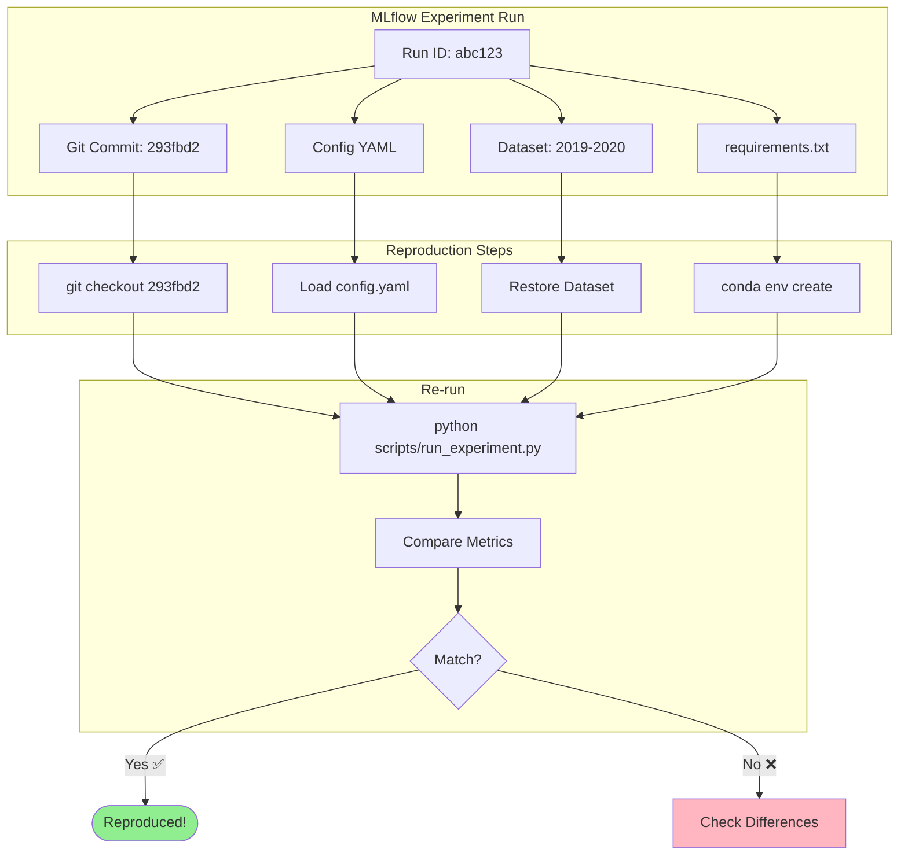

# Reproducibility & Traceability

This project guarantees reproducibility at three levels:

1. **Code versioning** (Git)
2. **Experiment versioning** (MLflow)
3. **Configuration versioning** (Hydra config dumps)

---

## 1. Git Commit Tracking

Each MLflow run logs:

- the current Git commit hash,
- whether the repository is "clean" or has uncommitted changes.

This ensures full traceability between:

- code version,
- experiments,
- results.

**No experiment should run without logging the Git commit.**

---

## 2. Hydra Configuration Dump

For every experiment, the full Hydra configuration (after resolving defaults) is stored in MLflow:

```
<run>/artifacts/config/config.yaml
```

This includes:

- asset parameters,
- bar construction parameters,
- triple barrier configuration,
- model hyperparameters,
- walk-forward settings,
- risk model parameters.

**This guarantees that any experiment can be fully reconstructed.**

---

## 3. Data Versioning

Each experiment logs:

- the date range used,
- the dataset path or version identifier,
- a hash of the clean Parquet file (optional but recommended).

This ensures traceability of the input data.

---

## 4. Environment Versioning

The following environment metadata is logged:

- Python version
- Major library versions (numpy, pandas, sklearn, cudf, cuml, hmmlearn, etc.)
- Optionally: `pip freeze` as artifact (`requirements.txt`)

This avoids inconsistencies over time.

---

## 5. Reproduction Checklist

To reproduce any MLflow run:

1. Checkout the Git commit hash.
2. Restore the dataset version.
3. Load the logged Hydra `config.yaml`.
4. Recreate the environment using the logged requirements.
5. Run the same experiment entrypoint.

**This guarantees faithful reproduction of training, backtest, and risk analysis results.**

---

## 6. Reproduction Workflow



This workflow ensures that any experiment can be faithfully reproduced by following the logged metadata.

